<h1 align="center">
  <a href="https://github.com/nouaim/sirati" title="سيرتي">
    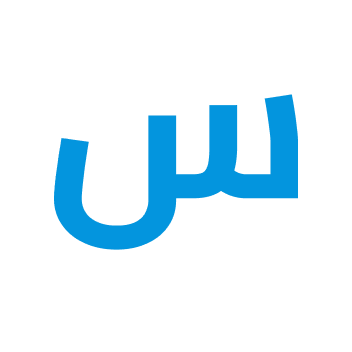
  </a>
  <br />
  سيرتي
</h1>

<p align="center">
  قالب سيرة ذاتية ورسالة تغطية بالعربية، من اليمين إلى اليسار، لـ LaTeX
</p>

<div align="center">
  <a href="https://github.com/posquit0/Awesome-CV">
    
  </a>
  <a href="https://creativecommons.org/licenses/by-sa/4.0/">
    
  </a>
  <a href="https://github.com/nouaim/sirati/actions/workflows/main.yml">
    
  </a>
  <a href="https://raw.githubusercontent.com/nouaim/sirati/main/examples/cv-ar.pdf">
    
  </a>
  <a href="https://raw.githubusercontent.com/nouaim/sirati/main/examples/coverletter-ar.pdf">
    
  </a>
</div>

<br />

<p align="center">
  <strong>العربية</strong> · <a href="README.en.md">English</a>
</p>


## ما هذا المشروع؟

**سيرتي** نسخة عربية من [Awesome CV](https://github.com/posquit0/Awesome-CV)،
القالب الذي أنشأه [Claud D. Park](https://github.com/posquit0) لـ LaTeX.

الأمثلة العربية هنا **مستندات XeLaTeX قائمة بذاتها**، مكتوبة لصفّ النص من اليمين إلى
اليسار عبر [polyglossia](https://ctan.org/pkg/polyglossia). لا يحتوي هذا المستودع على
ملف الصنف (class) الأصلي: فتخطيطه مبنيّ على جداول من اليسار إلى اليمين، أما التخطيط
العربي هنا فيأتي من إعداد اللغة نفسها. ولذلك تُصرَّف المستندات وحدها دون تثبيت أي صنف.

وإن أردت القالب الإنجليزي الأصلي وصنفه، فاستخدم
[مشروع Awesome CV الأصلي](https://github.com/posquit0/Awesome-CV)؛ فهو المرجع الأول،
وهذا المستودع مشتقّ منه.


## معاينة

* [السيرة الذاتية بالعربية (PDF)](examples/cv-ar.pdf)
* [رسالة التغطية بالعربية (PDF)](examples/coverletter-ar.pdf)

| السيرة الذاتية | رسالة التغطية |
|:---:|:---:|
| [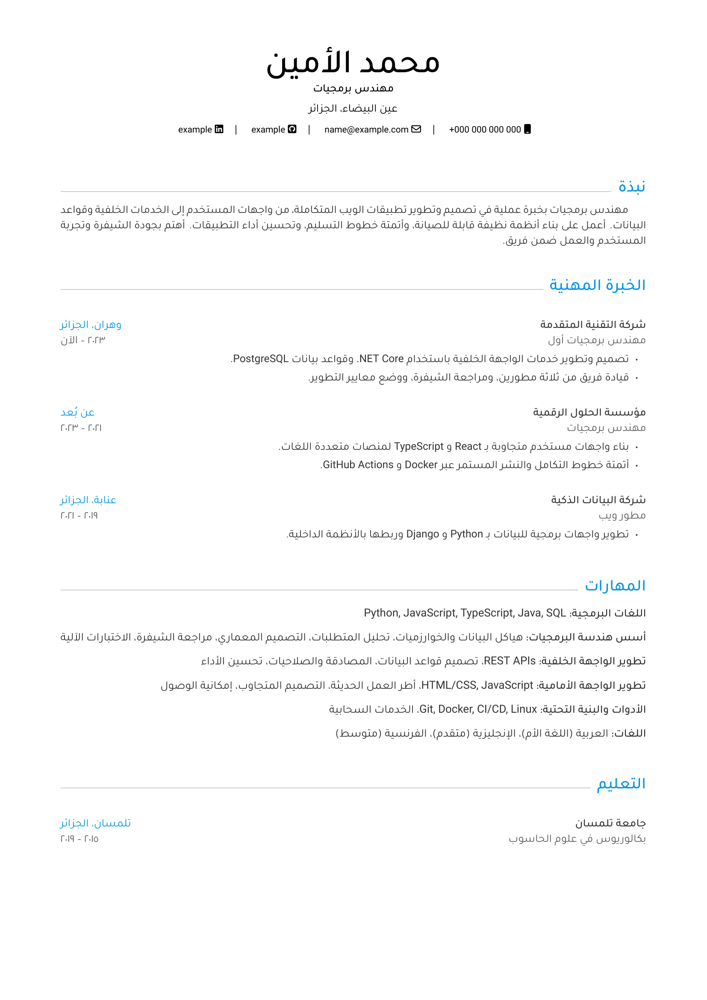](examples/cv-ar.pdf) | [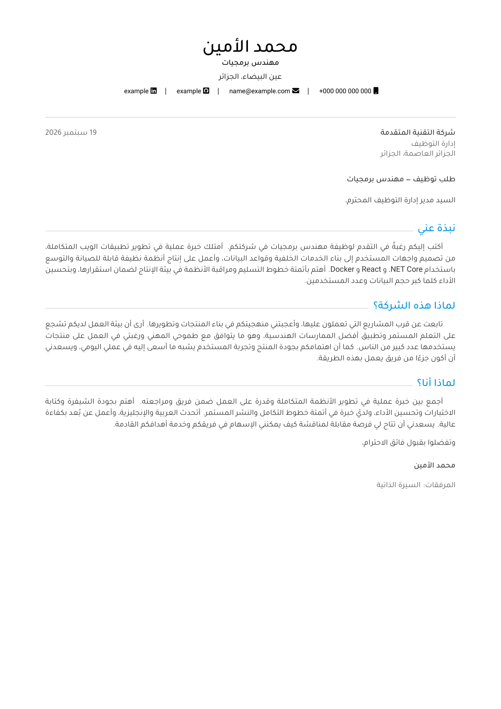](examples/coverletter-ar.pdf) |

المستندان في صفحة واحدة. والصور أعلاه مولَّدة من ملفات PDF المبنيّة وتُحدَّث بالأمر
`make previews`.


## المتطلبات

طريقتان للحصول على بيئة عمل كاملة، والاختبارات تغطّي الطريقتين، وطريق Docker يعمل على
أي نظام تشغيل.

### ١. التثبيت على النظام (لينكس وmacOS)

```bash
./install.sh
# أو قبل الاستنساخ:
curl -fsSL https://raw.githubusercontent.com/nouaim/sirati/main/install.sh | sh
```

سكربت POSIX sh واحد: يتصرّف التصرّف نفسه بـ `sh` أو `bash` أو `zsh`، وإعادة تشغيله
آمنة. وفرع macOS لم يُجرَّب على جهاز Mac حقيقي بعد. **وكل خطوة وكل حزمة يثبّتها مشروحة
في التعليقات داخل السكربت نفسه.**

### ٢. التثبيت عبر Docker (أي نظام تشغيل)

```bash
make docker                  # بناء الصورة ثم تصريف المستندين
make docker-previews         # صور المعاينة
make docker-test             # الاختبارات
make docker TARGET=cv-ar     # أو أي هدف وحده بدل المستندين
```

والأوامر الصريحة التي تغلّفها هذه الأهداف مكتوبة في تعليقات ملف `Makefile`. والصورة
كبيرة (نحو ٩ غيغابايت من TeX Live) وتُسحب مرة واحدة.


## الاستخدام

ابنِ السيرة الذاتية العربية:

```bash
make cv-ar
```

وابنِ رسالة التغطية العربية:

```bash
make coverletter-ar
```

وفي الحالتين ينتج الملف `examples/cv-ar.pdf` أو `examples/coverletter-ar.pdf`.
ويمكنك التصريف مباشرة:

```bash
cd examples && xelatex cv-ar.tex
```

والأمر `make` وحده يبني المستندين.


## التخصيص

يضع المستندان بيانات الشخص في كتلة واحدة واضحة في أعلى الملف، وتُحفظ نصوص رسالة
التغطية في ملف منفصل (`examples/coverletter-ar/body.tex`) حتى يمكن تغيير الصياغة دون
المساس بالتخطيط:

* &rlm;`examples/cv-ar.tex` — تخطيط السيرة الذاتية وبياناتها
* &rlm;`examples/cv-ar/*.tex` — أقسام السيرة الذاتية
* &rlm;`examples/coverletter-ar.tex` — تخطيط الرسالة وبياناتها
* &rlm;`examples/coverletter-ar/body.tex` — نص الرسالة

والأمثلة تصف حاليًا **شخصًا وهميًا** يستخدم النطاق المحجوز `example.com`. استبدل تلك
القيم بقيمك.


### الورق

الورقة **بيضاء افتراضيًا**، ولا يلزم فعل شيء للبقاء عليها. وتأتي مع المستندين صبغة
اختيارية هي **ورق شامواه**، الورق الكريمي الذي تُطبع عليه الكتب العربية عادةً.

ولتشغيل الصبغة أزل التعليق عن سطرين في `examples/colours.tex`: سطر خط الأقسام الدافئ،
وسطر `\pagecolor` الذي يليه:

```latex
\definecolor{sectiondivider}{HTML}{B9A87F}   % خط دافئ: الخط الرمادي يختفي على الصبغة
\pagecolor{shamwa}                           % الصبغة نفسها
```

والأمر `\pagecolor` من حزمة `xcolor` التي يستدعيها المستندان أصلًا، فلا حاجة إلى حزمة
إضافية؛ ويرسم XeLaTeX الصبغة عبر الخاصية `background` في مشغّل الرسوم xdvipdfmx.
وقيمة `shamwa` (`#F7F0DC`) معرَّفة بـ `\definecolor` فيمكن تعديل الدرجة كما تحب.
ولأن الصبغة تغطّي الورقة كاملةً من الحافة إلى الحافة، لا بد من ضبط الطابعة على طباعة
ألوان الخلفية لتظهر على الورق.


## ألوان التمييز

اللون سطر واحد في `examples/colours.tex`، وهذه ثماني صبغات للمقارنة. و`make colours` يُعيد توليد المعاينات.

<p align="center"><strong>أزرق مخضرّ</strong> · <code>0F6E6E</code> · <a href="examples/colours/cv-teal.pdf">PDF</a></p>

<p align="center"><a href="examples/colours/cv-teal.pdf">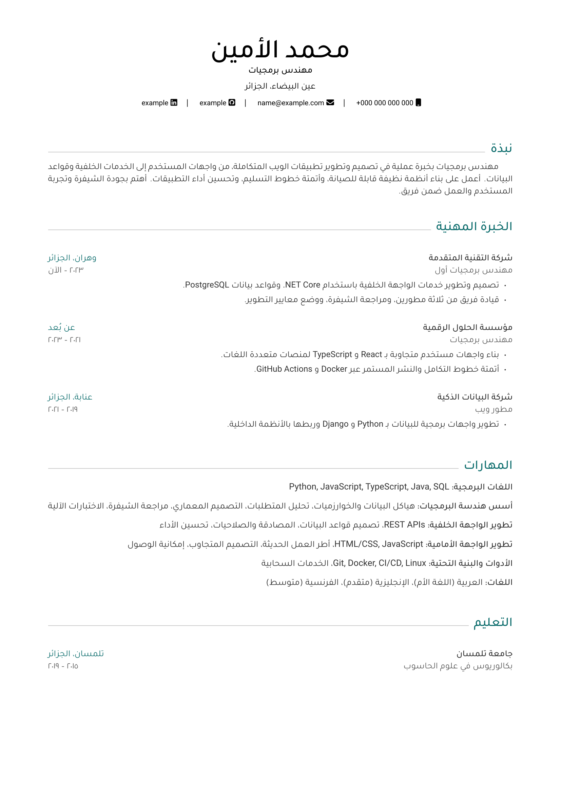</a></p>

<p align="center"><strong>زمردي</strong> · <code>1B7F5A</code> · <a href="examples/colours/cv-emerald.pdf">PDF</a></p>

<p align="center"><a href="examples/colours/cv-emerald.pdf">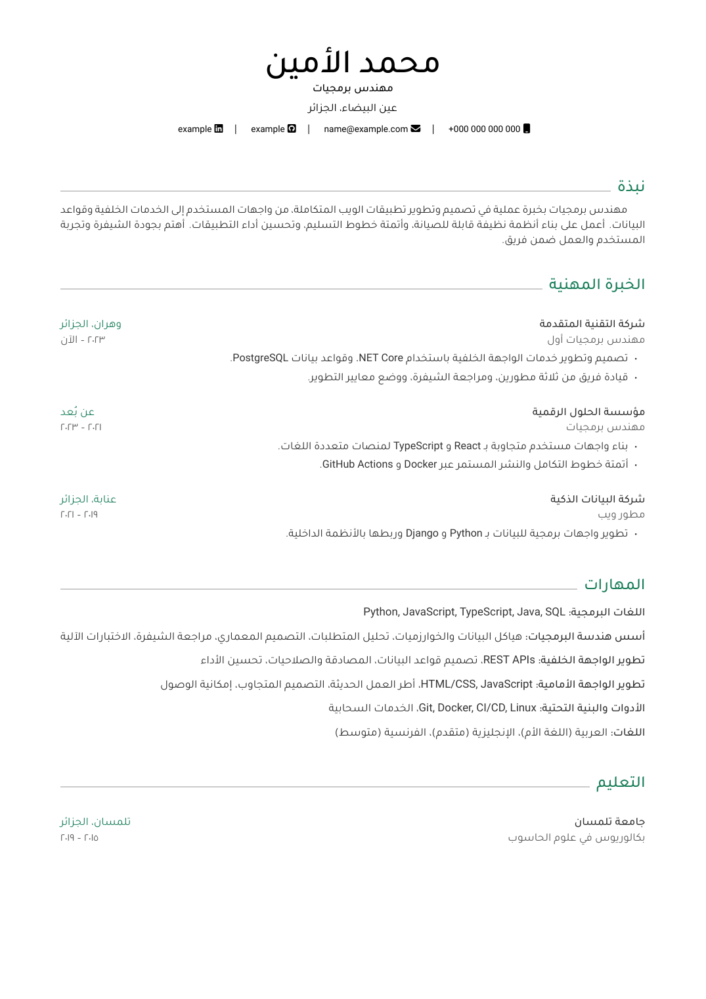</a></p>

<p align="center"><strong>كحلي</strong> · <code>283593</code> · <a href="examples/colours/cv-navy.pdf">PDF</a></p>

<p align="center"><a href="examples/colours/cv-navy.pdf">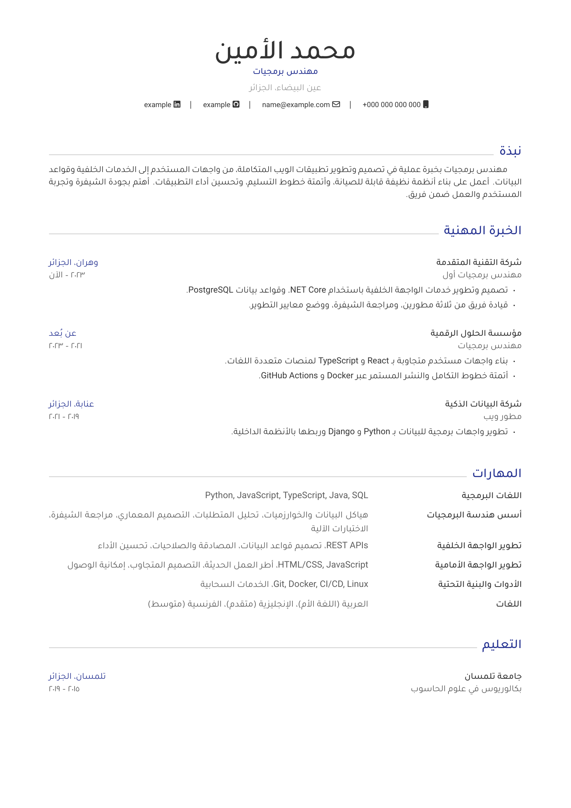</a></p>

<p align="center"><strong>بنفسجي</strong> · <code>6A4C93</code> · <a href="examples/colours/cv-violet.pdf">PDF</a></p>

<p align="center"><a href="examples/colours/cv-violet.pdf">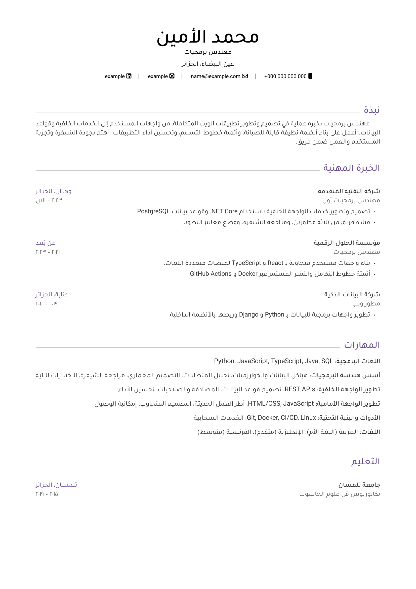</a></p>

<p align="center"><strong>وردي</strong> · <code>B03060</code> · <a href="examples/colours/cv-rose.pdf">PDF</a></p>

<p align="center"><a href="examples/colours/cv-rose.pdf">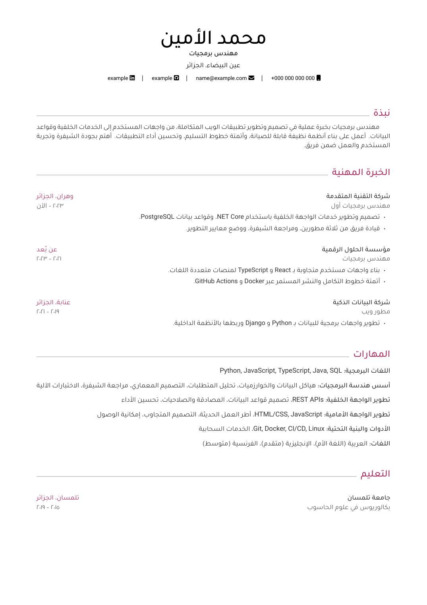</a></p>

<p align="center"><strong>عنّابي</strong> · <code>8C2F39</code> · <a href="examples/colours/cv-burgundy.pdf">PDF</a></p>

<p align="center"><a href="examples/colours/cv-burgundy.pdf">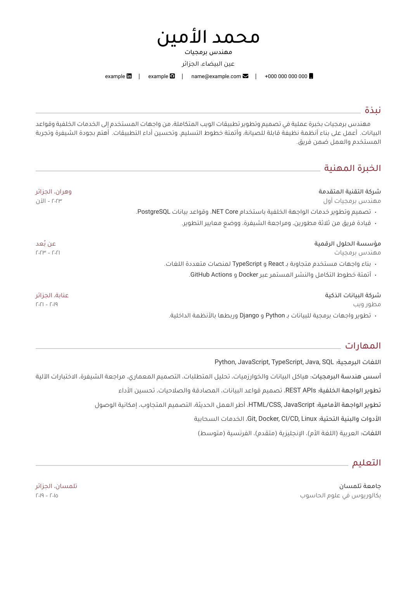</a></p>

<p align="center"><strong>برونزي</strong> · <code>9A6B2F</code> · <a href="examples/colours/cv-bronze.pdf">PDF</a></p>

<p align="center"><a href="examples/colours/cv-bronze.pdf">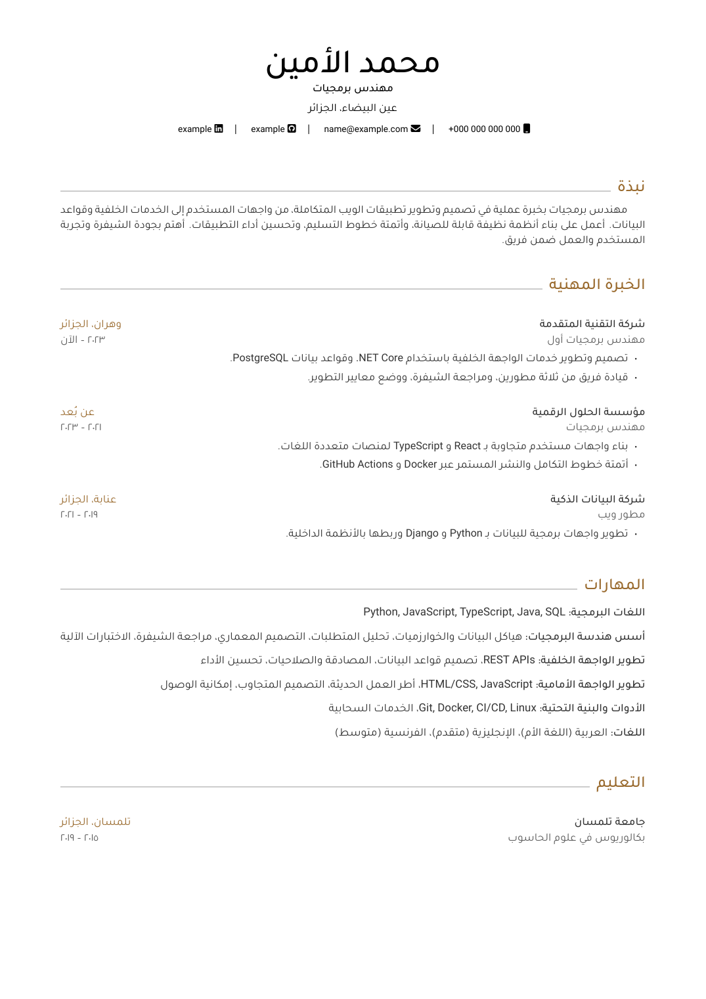</a></p>

<p align="center"><strong>جرافيت</strong> · <code>37474F</code> · <a href="examples/colours/cv-graphite.pdf">PDF</a></p>

<p align="center"><a href="examples/colours/cv-graphite.pdf">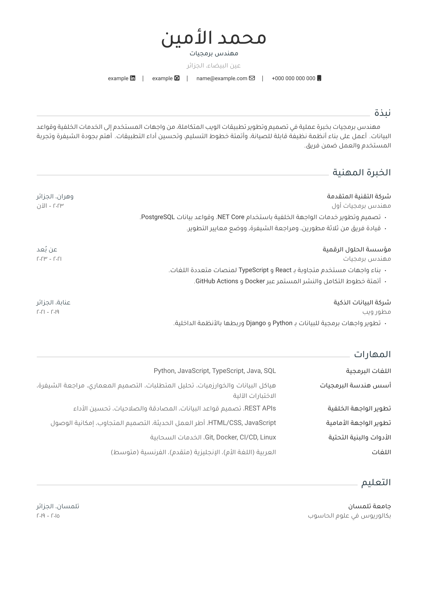</a></p>


## شكر وتقدير

&rlm;[**LaTeX**](https://www.latex-project.org) برنامج تنضيد رائع يستخدمه كثيرون، ولا سيما
في الرياضيات وعلوم الحاسوب في الأوساط الأكاديمية.

&rlm;[**Awesome CV**](https://github.com/posquit0/Awesome-CV) المشروع الأصلي الذي اشتُقّ
منه هذا المستودع، أنشأه [Claud D. Park](https://github.com/posquit0) بمساهمات من
مجتمعه.

&rlm;[**FontAwesome7 LaTeX Package**](https://ctan.org/pkg/fontawesome7) حزمة LaTeX توفّر
أيقونات [Font Awesome 7](https://fontawesome.com/v7/icons).

&rlm;[**Tajawal**](https://github.com/googlefonts/tajawal) الخط العربي المستخدم في الأمثلة
العربية.

&rlm;[**Roboto**](https://github.com/google/roboto) الخط الافتراضي في أندرويد وChromeOS،
والخط الموصى به للغة Google البصرية، Material Design.

&rlm;[**Source Sans Pro**](https://github.com/adobe-fonts/source-sans-pro) مجموعة خطوط
OpenType مصمّمة للعمل جيدًا في واجهات المستخدم.


## المساهمة

المساهمات مرحّب بها، وأكثر ما نحتاجه الآن من يجرّب التثبيت على macOS أو Windows.
والخطوات كلها — من فتح القضية إلى Pull Request — في
[دليل المساهمة](CONTRIBUTING.md).


## الترخيص

كل ما في هذا المستودع — السيرة الذاتية العربية ورسالة التغطية وملفات أقسامهما وملفات
البناء — منشور تحت
[رخصة المشاع الإبداعي نَسب المُصنَّف — الترخيص بالمثل 4.0 دولي](https://creativecommons.org/licenses/by-sa/4.0/)
(CC BY-SA 4.0). ونصّ الرخصة الكامل في [LICENSE](LICENSE).

وهذه الرخصة تخصّ القالب: فإن عدّلت عليه وأعدت نشر نسختك سرت الشروط نفسها عليها. أما
محتوى سيرتك فهو ملكك؛ فالرخصة تتعلق بملفات القالب وتصميمه، لا بما تكتبه فيه.

ولا يُوزَّع هنا أي ملف تحت رخصة LaTeX Project Public License، فملف `awesome-cv.cls`
من المشروع الأصلي **غير** مضمَّن عن قصد: فتخطيطه مبنيّ على جداول من اليسار إلى اليمين،
والمستندات العربية لا تستخدمه، وبإغفاله لا يبقى أي مكوّن تحت LPPL يلزم الالتزام به. وإن
أردته فخذه من [المشروع الأصلي](https://github.com/posquit0/Awesome-CV).


## ما تغيّر عن المشروع الأصلي

بالمقارنة مع [Awesome CV](https://github.com/posquit0/Awesome-CV)، هذا المستودع:

* يعيد كتابة السيرة الذاتية ورسالة التغطية كمستندين قائمين بذاتهما بـ XeLaTeX ومن
  اليمين إلى اليسار عبر [polyglossia](https://ctan.org/pkg/polyglossia)، بدل البناء
  على الصنف وتخطيطه من اليسار إلى اليمين؛
* يحذف ملف الصنف `awesome-cv.cls` كليًا؛
* يستبدل الأمثلة الإنجليزية بالزوج العربي، فيشحن المستودع سيرة ذاتية واحدة ورسالة
  تغطية واحدة بدل أمثلة متعددة؛
* يستخدم Font Awesome 7 بدلًا من Font Awesome 6؛
* يُبقي الورقة بيضاء لكنه يشحن صبغة ورق شامواه اختيارية، على بعد سطرين معلَّقين في كل
  مستند؛
* يجلب الخط العربي (Tajawal، برخصة SIL OFL 1.1) عند البناء بدل تضمين أي ملف خط.
