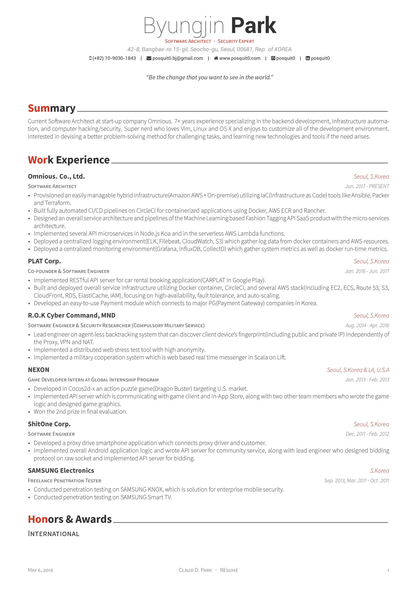
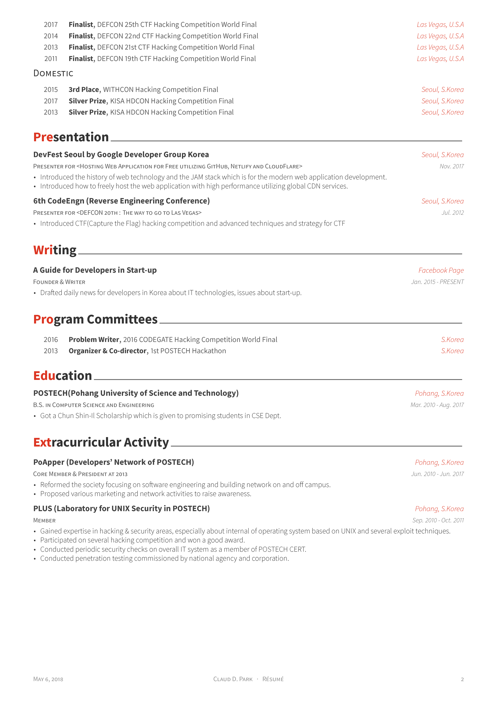

<h1 align="center">
  <a href="https://github.com/nouaim/awesome-arabic-cv" title="Awesome Arabic CV">
    
  </a>
  <br />
  Awesome Arabic CV
</h1>

<p align="center">
  An Arabic-first, right-to-left CV and cover-letter template for LaTeX — سبرتي
</p>

<div align="center">
  <a href="https://github.com/posquit0/Awesome-CV">
    
  </a>
  <a href="https://www.latex-project.org/lppl.txt">
    
  </a>
</div>

<br />


## What is this?

**Awesome Arabic CV** is an Arabic-first take on
[Awesome CV](https://github.com/posquit0/Awesome-CV), the LaTeX template by
[Claud D. Park](https://github.com/posquit0).

The Arabic examples are **self-contained XeLaTeX documents** written for
right-to-left typesetting with [polyglossia](https://ctan.org/pkg/polyglossia).
They deliberately do not build on `awesome-cv.cls`, because that class lays pages
out with left-to-right tables; the RTL layout comes from the language setting
instead. Each document therefore also works on its own, without the class.

If you want the original English template, use
[upstream Awesome CV](https://github.com/posquit0/Awesome-CV).


## Preview

* [Arabic CV (PDF)](examples/cv-ar.pdf)
* [Arabic cover letter (PDF)](examples/coverletter-ar.pdf)

#### Résumé (upstream example)

You can see [PDF](examples/resume.pdf)

| Page. 1 | Page. 2 |
|:---:|:---:|
| [](examples/resume.pdf)  | [](examples/resume.pdf) |


## Requirements

A full TeX distribution is assumed, with **XeLaTeX** and the
**polyglossia** package. [TeX Live](https://tug.org/texlive/) is recommended.

The Arabic examples additionally need:

* **Font Awesome 7** — the CTAN package
  [`fontawesome7`](https://ctan.org/pkg/fontawesome7), which provides the
  [Font Awesome 7](https://fontawesome.com/v7/icons) icon set
* an **Arabic font** — the examples use **Tajawal**, referenced by family name
* a **Latin font** — the examples use **Roboto**, referenced by family name

No font files are bundled with this repository, so referencing fonts by family
name means your system has to provide them (for example
`sudo apt install fonts-tajawal fonts-roboto`).


## Usage

Build the Arabic CV:

```bash
make cv-ar
```

Build the Arabic cover letter:

```bash
make coverletter-ar
```

In either case this produces `examples/cv-ar.pdf` or
`examples/coverletter-ar.pdf`. You can also compile directly:

```bash
cd examples && xelatex cv-ar.tex
```

The upstream résumé example still builds with LuaLaTeX through `make examples`.


## Customising

Both Arabic documents keep the person's details in one clearly marked block near
the top of the file, and the cover letter keeps its prose in a separate file
(`examples/coverletter-ar/body.tex`) so the wording can be changed without
touching the layout:

* `examples/cv-ar.tex` — CV layout and details
* `examples/cv-ar/*.tex` — CV sections
* `examples/coverletter-ar.tex` — letter layout and details
* `examples/coverletter-ar/body.tex` — letter prose

The examples currently describe a **fictional person** using the reserved domain
`example.com`. Replace those values with your own.


## Credit

[**LaTeX**](https://www.latex-project.org) is a fantastic typesetting program that a lot of people use these days, especially the math and computer science people in academia.

[**Awesome CV**](https://github.com/posquit0/Awesome-CV) is the original project this repository is derived from, created by [Claud D. Park](https://github.com/posquit0) with contributions from its community.

[**FontAwesome7 LaTeX Package**](https://ctan.org/pkg/fontawesome7) is a LaTeX package that provides access to the [Font Awesome 7](https://fontawesome.com/v7/icons) icon set.

[**Tajawal**](https://github.com/googlefonts/tajawal) is the Arabic typeface used by the Arabic examples.

[**Roboto**](https://github.com/google/roboto) is the default font on Android and ChromeOS, and the recommended font for Google’s visual language, Material Design.

[**Source Sans Pro**](https://github.com/adobe-fonts/source-sans-pro) is a set of OpenType fonts that have been designed to work well in user interface (UI) environments.


## Licence

* The class file `awesome-cv.cls` is published under the
  [LaTeX Project Public License v1.3c](https://www.latex-project.org/lppl.txt),
  as it is in the upstream project.
* The template and example files are published under the
  [CC BY-SA 4.0](https://creativecommons.org/licenses/by-sa/4.0/) licence, as
  they are upstream.

Both licences come from upstream Awesome CV and are kept here unchanged.


## Upstream policy

The upstream author asks that his own résumé not be reused:

> You are free to take my `.tex` file and modify it to create your own resume.
> Please don't use my resume for anything else without my permission, though!

This repository respects that request. The upstream author's personal content —
his name, photograph, address, contact details and résumé content — is not part
of the Arabic examples, which describe a fictional placeholder person instead.

The attribution comments naming the original author in the source-file headers
are kept deliberately, as the licence requires the notices to be preserved.


## A note on maintenance

This repository is a derived work and is **not** maintained by the authors or
maintainers of upstream [Awesome CV](https://github.com/posquit0/Awesome-CV).
Please direct questions about *this* repository here; questions about the
original class belong upstream.


## Support the upstream project

Upstream Awesome CV is kept alive by donations. If you find the original class
useful, consider supporting it:

    PayPal: paypal.me/posquit0

*Thank you for your support!*


## See Also

* [Awesome Identity](https://github.com/posquit0/hugo-awesome-identity) - A single-page Hugo theme to introduce yourself.
